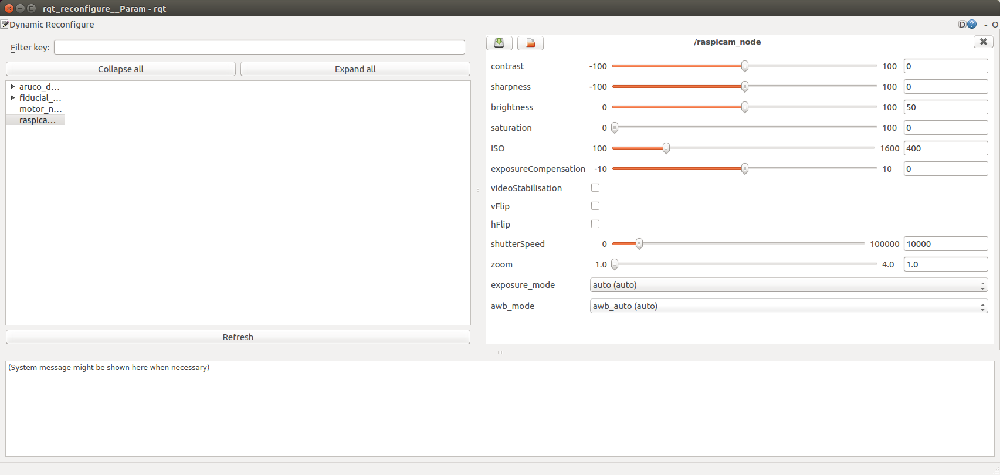

# raspicam_node

ROS node for the Raspberry Pi Camera Module. Works with both the V1.x and V2.x versions of the module. We recommend using the v2.x cameras as they have better auto gain, and the general image quality is better. 

## Build Intructions
This node is primarily supported on ROS Kinetic, and Ubuntu 16.04, and that is what these instuctions presume.

Go to your catkin_ws `cd ~/catkin_ws/src`.

Download the source for this node by running

`git clone https://github.com/UbiquityRobotics/raspicam_node.git`

There are some dependencies that are not recognized by ros, so you need to create the file `/etc/ros/rosdep/sources.list.d/30-ubiquity.list` and add this to it.
```
yaml https://raw.githubusercontent.com/UbiquityRobotics/rosdep/master/raspberry-pi.yaml
```

Then run `rosdep update`.

Install the ros dependencies, 

```
cd ~/catkin_ws
rosdep install --from-paths src --ignore-src --rosdistro=kinetic -y
```

Compile the code with `catkin_make`.

## Running the Node
Once you have the node built, you can run it using a launch file.

For a V2.x camera, run `roslaunch raspicam_node camerav2_1280x960.launch`

For a V1.x camera, run `roslaunch raspicam_node camerav1_1280x720.launch`

Use `rqt_image_view` to view the published image.

## Configuring the node with dynamic reconfigure

This section describes how to use a second computer to dynamically adjust the paramaters of the node.
It assumes that the Raspberry PI on which the `raspicam_node` is running has a hostname of `raspi.local`
and that the reconfiguration is being run on a second computer with a hostname of `laptop.local`.

1. Ensure that the ROS environment variables on `raspi.local` are set so that other machines can interact
with its ROS nodes.  If they varaiables contain the string `localhost`, they need to be changed.

```
ubuntu@raspi:~$ echo $ROS_HOSTNAME 
raspi.local
ubuntu@raspi:~$ echo $ROS_MASTER_URI 
http://raspi.local:11311
```

If necessary they can be adjusted thus:

```
export ROS_HOSTNAME=`hostname`.local
export ROS_MASTER_URI=${ROS_HOSTNAME}:11311
```

The changes can be made persistent by adding those two lines to `~/.bashrc`.

2. One the laptop, set the environment variable `ROS_MASTER_URI` as above:

```
export ROS_MASTER_URI=${ROS_HOSTNAME}:11311
```

3. Run the dynamic reconfigure node on `laptop.local`:


```
rosrun rqt_reconfigure rqt_reconfigure 
```

It should bring up a user interface like the one below.  Paramaters can be dynamically adjusted via this interface.




## Troubleshooting
1. Make sure that your user is in the `video` group by running `groups|grep video`.

2. If you get an error saying: `Failed to create camera component`,
make sure that the camera cable is properly seated on both ends, and that the cable is not missing any pins. If this doesn't work update your firmware with `rpi-update`.

## Node Information

Topics:

* `/raspicam_node/compressed`:
  Publishes `sensor_msgs/CompressedImage` with jpeg from the camera module.

* `/raspicam_node/camera_info`:
  Publishes `sensor_msgs/CameraInfo` camera info for each frame.

Services:

* `/set_camera_info`: Used to update calibration info for the camera.

Parameters:

* `camera_frame_id` (tf frame): The frame identifier to associate the camera.

* `camera_info_url`: The URL of the camera calibration `.yaml` file.

* `camera_name` (string): The name of the camera, should match with name in camera_info file.

* `framerate` (fps): Framerate to capture at. Maximum 90fps

* `height` (pixels): Height to capture images at.

* `width` (pixels): Width to capture images at.

* `quality` (0-100): Quality of the captured images.

## Calibration

The raspicam_node package contains a calibration file for the raspberry
PI camera versions 1 and 2.  The procedure for calibrating a camera is only necessary if you change the lens or image size used.

A tutorial 
  [Monocular Camera Calibration tutorial](http://wiki.ros.org/camera_calibration/Tutorials/MonocularCalibration)
shows how to calibrate a single camera.

The
  [8x6 checkerboard](http://wiki.ros.org/camera_calibration/Tutorials/StereoCalibration?action=AttachFile&do=view&target=check-108.pdf)
and the
  [7x6 checkerboard](http://wiki.ros.org/camera_calibration/Tutorials/StereoCalibration?action=AttachFile&do=view&target=check_7x6_108mm.pdf)
are rather large and require specialized printers to print out at
full scale.  They can be printed on more common printer sizes
with auto scaling turned on.  Be sure to carefully measure the
square size in millimeters and convert to meters by dividing by 1000.

A camera calibration can be run with the following commands:

    $ rosrun image_transport republish compressed in:=/raspicam_node/image raw out:=/raspicam_node/image
    $ rosrun camera_calibration cameracalibrator.py --size 8x6 --square 0.74 image:=/raspicam_node/image camera:=/raspicam_node

By default the camera calibrations are saved in the 
camera_info directory of this package.
